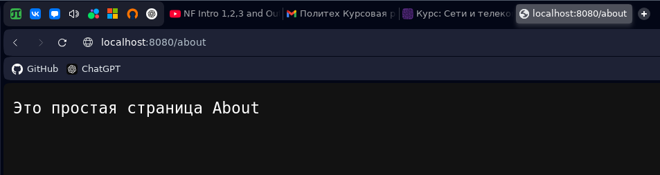

Работу выполнил студент 
```
Абраамян Александр Манвелович,
группа 5130904/10101,
4 курс
```

# Ответы на вопросы
Протокол HTTP (HyperText Transfer Protocol) — это основной протокол передачи данных в сети Интернет, который используется для взаимодействия веб-клиентов (например, браузеров) с веб-серверами.

HTTP необходим для передачи веб-страниц, изображений, видео, API-запросов и других ресурсов между клиентом и сервером. Он позволяет пользователям просматривать сайты, взаимодействовать с веб-приложениями и обмениваться данными между различными сервисами.

### Основные задачи HTTP

- Передача гипертекстовых документов (HTML, CSS, JavaScript).
- Взаимодействие клиента и сервера (отправка запросов и получение ответов).
- Поддержка REST API для обмена данными между веб-приложениями.
- Гибкость и расширяемость, позволяя передавать любые данные, а не только веб-страницы.
- Принцип работы HTTP

### Работа HTTP основана на модели "клиент-сервер"
- Клиент (например, браузер) отправляет HTTP-запрос на сервер.
- Сервер обрабатывает запрос и возвращает ответ.
- Клиент получает ответ, интерпретирует его (например, рендерит HTML-страницу) и отображает пользователю.

### Каждый HTTP-запрос содержит:
- Метод запроса (например, GET, POST, PUT, DELETE и др.).
- URL-адрес, указывающий, к какому ресурсу обращается клиент.
- Заголовки, содержащие информацию о клиенте, типе данных и другие параметры.
- Тело запроса (не всегда), например, в POST-запросах передаются данные формы.

### Ответ сервера включает
- Код состояния (например, 200 OK, 404 Not Found, 500 Internal Server Error).
- Заголовки ответа (например, Content-Type, Set-Cookie).
- Тело ответа, содержащее HTML, JSON или другие данные.

### Особенности HTTP
- Простота – текстовый протокол, легко читаемый и анализируемый.
- Статусная независимость – каждый запрос обрабатывается отдельно, сервер не помнит предыдущее состояние клиента (если не используются куки или сессии).
- Расширяемость – поддерживает различные типы данных и механизмы аутентификации.

### HTTP и HTTPS
Протокол HTTPS (HyperText Transfer Protocol Secure) – это расширение HTTP, обеспечивающее шифрование данных с помощью TLS (SSL). Он необходим для защиты информации от перехвата и подделки.

### Заключение
Протокол HTTP является основой веба, позволяя клиентам и серверам обмениваться данными. Он прост в использовании, но требует дополнительных механизмов безопасности, таких как HTTPS, для защиты информации.

## Формат HTTP-сообщения, HTTP-запросы, HTTP-ответы
HTTP – это текстовый протокол, где обмен данными происходит через сообщения, которые бывают двух типов:

- HTTP-запросы (requests) – отправляются клиентом (например, браузером) на сервер.
- HTTP-ответы (responses) – отправляются сервером в ответ на запрос.

### Формат HTTP-запроса
HTTP-запрос состоит из нескольких частей:

Стартовая строка – определяет метод запроса, целевой ресурс (URL) и версию протокола.
```
GET /index.html HTTP/1.1
```

- `GET` – метод запроса.
- `/index.html` – запрашиваемый ресурс.
- `HTTP/1.1` – версия протокола.

Заголовки (Headers) – содержат метаинформацию о запросе:
```
Host: www.example.com
User-Agent: Mozilla/5.0
Accept: text/html
```

- `Host` – указывает домен сервера.
- `User-Agent` – информация о клиенте (браузере, устройстве).
- `Accept` – указывает, какие форматы данных поддерживает клиент.

Тело запроса (Body) – передает данные, например, при POST или PUT.
```
name=John&age=25
```

### Методы HTTP-запросов
- `GET` – запрос ресурса (без изменения данных).
- `POST` – отправка данных (например, форма на сайте).
- `PUT` – обновление ресурса.
- `DELETE` – удаление ресурса.
- `HEAD` – как GET, но без тела ответа.
- `OPTIONS` – запрашивает доступные методы для ресурса.

### Формат HTTP-ответа
HTTP-ответ состоит из:

Стартовой строки – содержит версию HTTP, код состояния и текстовое описание.
```
HTTP/1.1 200 OK
```
- `200 OK` – успешный ответ.

Заголовки – дополнительная информация (тип содержимого, длина, кэширование).
```
Content-Type: text/html
Content-Length: 1024
```
- `Content-Type` – формат содержимого (text/html, application/json).
- `Content-Length` – размер ответа в байтах.

Тело ответа – передает сам контент (HTML, JSON, изображение).
```
<html><body>Hello, world!</body></html>
```
### Коды состояния HTTP
```
200 OK – успешно.
301 Moved Permanently – ресурс перемещен.
400 Bad Request – ошибка в запросе.
403 Forbidden – доступ запрещен.
404 Not Found – ресурс не найден.
500 Internal Server Error – ошибка сервера.
```
Кодов существует гораздо больше, выше приложены несколько наиболее распространённых.

## HTTP-серверы, HTTP-клиенты, прокси-серверы
HTTP-сервер – это программное обеспечение, обрабатывающее HTTP-запросы от клиентов и отправляющее HTTP-ответы.
Примеры популярных HTTP-серверов:

- `Apache HTTP Server` – мощный сервер с открытым исходным кодом.
- `NGINX` – высокопроизводительный сервер с поддержкой балансировки нагрузки.
- `Microsoft IIS` – сервер от Microsoft для Windows.

## Прокси-серверы
Прокси-сервер – это промежуточный сервер между клиентом и целевым HTTP-сервером.

## Виды прокси-серверов
- Прозрачные (Transparent Proxy) – просто пересылают трафик, не скрывая IP клиента.
- Анонимные (Anonymous Proxy) – скрывают реальный IP клиента.
- Обратные (Reverse Proxy) – стоят перед веб-серверами, балансируют нагрузку и кешируют контент.

## Зачем нужен прокси?
- Кеширование – ускоряет загрузку популярных страниц.
- Безопасность – скрывает внутреннюю структуру сети.
- Фильтрация контента – блокирует нежелательные сайты.
- Сжатие данных – снижает потребление трафика.

# Задание
Напишем на питоне сервер, который будет отвечать на запросы веб-приложения и возвращать разные страницы.
Доступны два ресурса: `/` и `/about`.
```python
from http.server import BaseHTTPRequestHandler, HTTPServer

class MyHTTPRequestHandler(BaseHTTPRequestHandler):
    def do_GET(self):
        if self.path == "/":
            self.send_response(200)
            self.send_header("Content-type", "text/html; charset=utf-8")
            self.end_headers()
            self.wfile.write("<h1>Привет! Это мой HTTP-сервер на Python</h1>".encode("utf-8"))
        elif self.path == "/about":
            self.send_response(200)
            self.send_header("Content-type", "text/plain; charset=utf-8")
            self.end_headers()
            self.wfile.write("Это простая страница About".encode("utf-8"))
        else:
            self.send_response(404)
            self.send_header("Content-type", "text/plain; charset=utf-8")
            self.end_headers()
            self.wfile.write("Страница не найдена".encode("utf-8"))

host = "localhost"
port = 8080

server = HTTPServer((host, port), MyHTTPRequestHandler)
print(f"Сервер запущен на http://{host}:{port}")
server.serve_forever()
```

Попробуем обратиться к серверу с помощью браузера. Приложение должно отображать сообщение "Привет! Это мой HTTP-сервер на Python".


Теперь обратимся к ресурсу `/about`. Приложение должно отображать сообщение "Это простая страница About".


## Настройки оптимизации
### Включение сжатия (Gzip, Brotli)
Сжатие позволяет уменьшить размер передаваемых данных и ускорить загрузку страниц.

### Использование HTTP/2 и HTTP/3
- HTTP/2 уменьшает задержки за счет мультиплексирования (несколько запросов в одном соединении).
- HTTP/3 (QUIC) ускоряет передачу данных и снижает потери пакетов.

### Использование кэширования
- Кэширование на сервере: хранение сгенерированных страниц в памяти (memcached, Redis).
- Кэширование на клиенте: заголовки Cache-Control, ETag, Expires.
- CDN (Cloudflare, Akamai) помогает раздавать статический контент быстрее.

### Балансировка нагрузки
Если на сервер поступает много запросов, можно распределять их между разными машинами:

## Увеличение надежности HTTP-сервера
### Лимитирование запросов (Rate Limiting)
Чтобы защититься от перегрузки или DDoS-атак, можно ограничить число запросов с одного IP:

### Автоматический перезапуск сервера
systemd или supervisor для автоматического перезапуска процессов.
pm2 для Node.js-приложений.

### Мониторинг и логирование
Grafana + Prometheus – мониторинг загрузки сервера.
ELK Stack (Elasticsearch + Logstash + Kibana) – анализ логов.
Sentry – отслеживание ошибок веб-приложений.

### Репликация и отказоустойчивость
Использование кластеров (Kubernetes, Docker Swarm).
Репликация баз данных (Master-Slave, Master-Master).

## Безопасность: Настройка SSL и защита сервера
### Включение HTTPS (SSL/TLS)
- Получение сертификата SSL (Let's Encrypt, GlobalSign).
- Размещение сертификата на сервере.
### Защита от атак
Включение Content Security Policy (CSP) для защиты от XSS.
Настройка HSTS (HTTP Strict Transport Security) для принудительного использования HTTPS.
Отключение Server Tokens в NGINX, чтобы скрыть версию сервера.
### Ограничение доступа к серверу
Использование Fail2Ban для блокировки подозрительных IP.
Запрет на доступ к /.git, /config.php через location в NGINX.
Минимизация открытых портов (firewalld, iptables).
